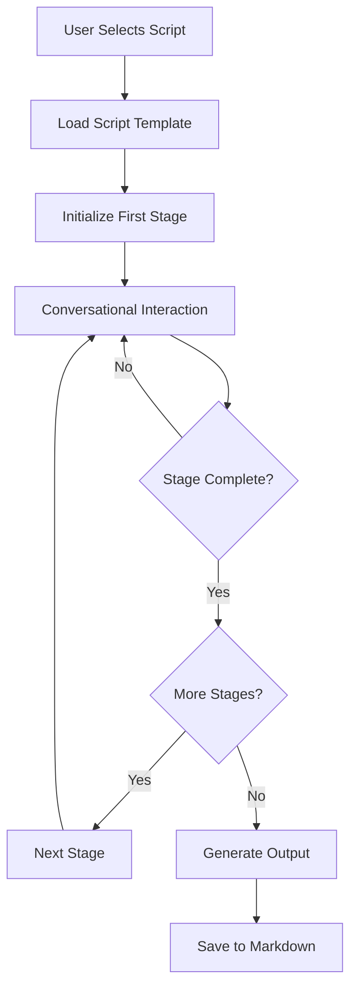

# AI Assistant Architecture - Real-time Collaborative Writing System

## Overview
A real-time AI assistant that helps users through various interactive scripts (blog writing, improv games, etc.) with voice conversation and local markdown file manipulation. Built using OpenAIs Realtime API with Python backend.

## System Architecture

### Core Components

```
┌─────────────────────────────────────────────────────┐
│              Third-Party Editor/Client              │
│                                                      │
│  ├── Audio Input/Output (Microphone/Speaker)        │
│  ├── WebSocket Client                               │
│  └── File System Access (for markdown files)        │
└────────────────┬────────────────────────────────────┘
                 │ WebSocket
┌────────────────▼────────────────────────────────────┐
│                  Python Backend                      │
│                                                      │
│  ├── WebSocket Server                               │
│  ├── OpenAI Realtime API Client                     │
│  ├── Tool Manager                                   │
│  │   ├── Script Loader Tool                         │
│  │   └── File Operations Tool                       │
│  ├── Script Library                                 │
│  └── File Handler (Local .md files)                 │
└─────────────────────────────────────────────────────┘
```

## Implementation Details

### 1. Backend Server (`server.py`)

```python
# Main server components
class RealtimeAssistant:
    def __init__(self):
        self.openai_client = OpenAIRealtimeClient()
        self.tool_manager = ToolManager()
        self.script_library = ScriptLibrary()
        self.file_handler = FileHandler()
        self.websocket_server = WebSocketServer()
        self.current_script = None
        self.working_file = "output.md"  # Default markdown file
```

#### Key Responsibilities:
- Manage WebSocket connections between client and OpenAI
- Handle tool execution requests
- Load and execute interactive scripts
- Manipulate local markdown files

### 2. OpenAI Realtime API Integration

#### Configuration
```python
REALTIME_CONFIG = {
    "model": "gpt-4o-realtime-preview-2024-12-17",
    "voice": "verse",  # or "echo", "alloy", "shimmer"
    "instructions": load_system_prompt(),  # Load from system_prompt.md
    "input_audio_format": "pcm16",
    "output_audio_format": "pcm16",
    "turn_detection": {
        "type": "server_vad",
        "threshold": 0.5,
        "prefix_padding_ms": 300,
        "silence_duration_ms": 500
    },
    "tools": [
        {
            "type": "function",
            "name": "load_script",
            "description": "Load an interactive script to guide the conversation"
        },
        {
            "type": "function", 
            "name": "file_operation",
            "description": "Perform operations on local markdown files"
        }
    ]
}
```

### 3. Tool Implementations

#### Tool 1: Script Loader Tool (`script_tool.py`)

```python
class ScriptLoaderTool:
    def __init__(self, script_library):
        self.script_library = script_library
        self.active_script = None
    
    def execute(self, script_name: str) -> dict:
        """
        Load and activate an interactive script
        
        Args:
            script_name: Name of the script to load
            
        Returns:
            {"success": bool, "script": dict, "instructions": str}
        """
```

**Script Library Structure:**
```python
SCRIPTS = {
    "blog_writer": {
        "name": "Blog Post Writing Assistant",
        "description": "Helps create engaging blog posts through conversation",
        "stages": [
            {
                "name": "discovery",
                "prompt": "First, let's explore your topic. What are you passionate about? What unique perspective do you bring?",
                "questions": ["What's your main message?", "Who's your audience?", "What's your unique angle?"]
            },
            {
                "name": "outline",
                "prompt": "Now let's structure your ideas into a compelling narrative...",
                "actions": ["create_outline", "suggest_sections"]
            },
            {
                "name": "writing",
                "prompt": "Let's bring your outline to life with engaging prose...",
                "actions": ["write_section", "add_examples", "refine_tone"]
            }
        ],
        "output_format": "markdown",
        "interactive_elements": ["brainstorming", "feedback_loops", "style_coaching"]
    },
    
    "improv_game": {
        "name": "Yes, And... Improv Game",
        "description": "Play collaborative storytelling games",
        "stages": [
            {
                "name": "setup",
                "prompt": "Let's create a story together! I'll start with a scenario, and we'll build on each other's ideas using 'Yes, and...'",
                "rules": ["Accept what's given", "Add new information", "Keep it flowing"]
            },
            {
                "name": "play",
                "prompt": "Remember to build on what I say and add your own twist!",
                "actions": ["continue_story", "add_character", "introduce_conflict"]
            }
        ],
        "output_format": "markdown",
        "save_transcript": true
    },
    
    "email_workshop": {
        "name": "Email Writing Workshop",
        "description": "Craft effective emails through guided practice",
        "stages": [
            {
                "name": "context",
                "prompt": "Tell me about the email you need to write. What's the situation?",
                "questions": ["What's your relationship?", "What outcome do you want?", "Any sensitivities?"]
            },
            {
                "name": "drafting",
                "prompt": "Let's draft this email together, starting with your key message...",
                "techniques": ["pyramid_principle", "action_oriented", "empathy_mapping"]
            }
        ],
        "output_format": "markdown"
    },
    
    "brainstorm_session": {
        "name": "Creative Brainstorming Session",
        "description": "Generate and develop ideas interactively",
        "stages": [
            {
                "name": "diverge",
                "prompt": "Let's generate as many ideas as possible. No judgment, just creativity!",
                "techniques": ["word_association", "reverse_brainstorming", "scamper_method"]
            },
            {
                "name": "converge",
                "prompt": "Now let's identify the most promising ideas and develop them further...",
                "actions": ["rank_ideas", "combine_concepts", "detail_development"]
            }
        ],
        "output_format": "markdown",
        "deliverable": "idea_map"
    },
    
    "interview_prep": {
        "name": "Interview Preparation Coach",
        "description": "Practice interviews with real-time feedback",
        "stages": [
            {
                "name": "setup",
                "prompt": "Let's prepare for your interview. What role and company?",
                "preparation": ["research_questions", "story_development", "answer_structure"]
            },
            {
                "name": "practice",
                "prompt": "I'll ask you interview questions and provide feedback on your responses...",
                "feedback_areas": ["clarity", "specificity", "energy", "structure"]
            }
        ],
        "output_format": "markdown",
        "creates": "interview_notes"
    }
}
```

#### Tool 2: File Operations Tool (`file_tool.py`)

```python
class FileOperationTool:
    def __init__(self, working_directory="./workspace"):
        self.working_dir = working_directory
        self.current_file = None
    
    def execute(self, operation: str, **kwargs) -> dict:
        """
        Perform operations on local markdown files
        
        Operations:
        - create: Create new markdown file
        - read: Read current file
        - write: Write/overwrite content
        - append: Add content to end
        - insert: Insert at specific line
        - replace: Find and replace text
        - save_as: Save with new filename
        
        Returns:
            {"success": bool, "content": str, "filepath": str}
        """
```

**File Operations Implementation:**
```python
class FileHandler:
    def __init__(self, working_dir="./workspace"):
        self.working_dir = Path(working_dir)
        self.working_dir.mkdir(exist_ok=True)
        
    def create_file(self, filename: str, content: str = "") -> str:
        """Create new markdown file with initial content"""
        
    def read_file(self, filename: str) -> str:
        """Read markdown file content"""
        
    def write_file(self, filename: str, content: str) -> bool:
        """Write content to markdown file"""
        
    def append_to_file(self, filename: str, content: str) -> bool:
        """Append content to existing file"""
        
    def insert_at_line(self, filename: str, line_num: int, content: str) -> bool:
        """Insert content at specific line number"""
        
    def find_and_replace(self, filename: str, pattern: str, replacement: str) -> int:
        """Replace all occurrences of pattern"""
        
    def create_backup(self, filename: str) -> str:
        """Create timestamped backup of file"""
```

### 4. WebSocket Communication Layer

```python
class WebSocketServer:
    async def handle_client(self, websocket):
        """Handle bidirectional communication"""
        
    async def forward_audio(self, audio_data):
        """Forward audio to OpenAI Realtime API"""
        
    async def send_file_update(self, filepath, content):
        """Notify client of file changes"""
        
    async def broadcast_script_state(self, script_stage):
        """Update client on current script stage"""
```

## API Flow

### Script Execution Flow



## File Structure

```
project/
├── backend/
│   ├── server.py                 # Main server
│   ├── realtime_client.py        # OpenAI Realtime API client
│   ├── tools/
│   │   ├── __init__.py
│   │   ├── script_tool.py        # Script loader tool
│   │   └── file_tool.py          # File operations tool
│   ├── handlers/
│   │   ├── __init__.py
│   │   ├── file_handler.py       # Local file operations
│   │   └── script_library.py     # Script management
│   ├── websocket_handler.py      # WebSocket communication
│   └── config.py                 # Configuration
├── scripts/
│   ├── blog_writer.json          # Blog writing script
│   ├── improv_game.json          # Improv game script
│   ├── email_workshop.json       # Email workshop script
│   ├── brainstorm.json           # Brainstorming script
│   └── interview_prep.json       # Interview prep script
├── workspace/                     # Working directory for markdown files
│   └── output.md                 # Default output file
├── prompts/
│   └── system_prompt.md          # Main system prompt
├── requirements.txt
└── README.md
```

## Key Implementation Notes

### Environment Variables
```env
OPENAI_API_KEY=your_api_key
WEBSOCKET_PORT=8765
WORKING_DIRECTORY=./workspace
DEFAULT_VOICE=verse
```

### Dependencies (`requirements.txt`)
```
openai>=1.0.0
websockets>=12.0
python-dotenv>=1.0.0
pathlib
asyncio
json
datetime
re
```

## Usage Example

### Starting the Server
```python
# server.py
async def main():
    assistant = RealtimeAssistant()
    
    # Load system prompt
    with open('prompts/system_prompt.md', 'r') as f:
        system_prompt = f.read()
    
    assistant.set_system_prompt(system_prompt)
    await assistant.start_server(host="localhost", port=8765)

if __name__ == "__main__":
    asyncio.run(main())
```

### Client Connection Example
```javascript
// Example WebSocket client connection
const ws = new WebSocket('ws://localhost:8765');

// Request to load a script
ws.send(JSON.stringify({
    type: 'tool_call',
    tool: 'load_script',
    params: { script_name: 'blog_writer' }
}));

// Handle file updates
ws.onmessage = (event) => {
    const data = JSON.parse(event.data);
    if (data.type === 'file_update') {
        // File has been updated at data.filepath
        console.log(`File updated: ${data.filepath}`);
    }
};
```

## Tool Function Signatures

### Script Loader Tool
```python
async def load_script(script_name: str) -> dict:
    """
    Loads an interactive script to guide the conversation
    
    Args:
        script_name: Name of script (e.g., "blog_writer", "improv_game")
    
    Returns:
        {
            "success": bool,
            "script_name": str,
            "current_stage": str,
            "instructions": str,
            "message": str
        }
    """
```

### File Operation Tool
```python
async def file_operation(
    operation: str,
    filename: str = "output.md",
    content: Optional[str] = None,
    line_number: Optional[int] = None,
    pattern: Optional[str] = None,
    replacement: Optional[str] = None
) -> dict:
    """
    Performs operations on local markdown files
    
    Args:
        operation: "create" | "read" | "write" | "append" | "insert" | "replace" | "save_as"
        filename: Target markdown file
        content: Text content for write operations
        line_number: Line number for insertions
        pattern: Search pattern for replacements
        replacement: Replacement text
    
    Returns:
        {
            "success": bool,
            "filepath": str,
            "content": str,  # For read operations
            "message": str
        }
    """
```

## Example Markdown Output Format

All scripts generate clean, well-formatted markdown:

```markdown
# Blog Post: [Title]
*Generated with AI Writing Assistant*

## Introduction
[Opening paragraph with hook]

## Main Points

### Point 1: [Heading]
[Content with supporting details]

### Point 2: [Heading]
[Content with examples]

## Conclusion
[Closing thoughts and call-to-action]

---
*Created on: [Date]*
*Script used: blog_writer*
```

## Testing Strategy

### Test Scenarios
1. **Blog Writing Session**: Full workflow from brainstorming to final markdown
2. **Improv Game**: Interactive storytelling with transcript saved to markdown
3. **File Operations**: Create, edit, and manage multiple markdown files
4. **Script Switching**: Seamlessly transition between different scripts

### Integration Tests
- Test WebSocket audio streaming
- Test script loading and stage progression
- Test file operations and markdown formatting
- Test error recovery and session persistence

## Future Enhancements
- Add more interactive scripts
- Support for multiple file formats beyond markdown
- Integration with version control (git)
- Custom script creation interface
- Multi-language support for scripts
- Export to various formats (PDF, HTML, DOCX)